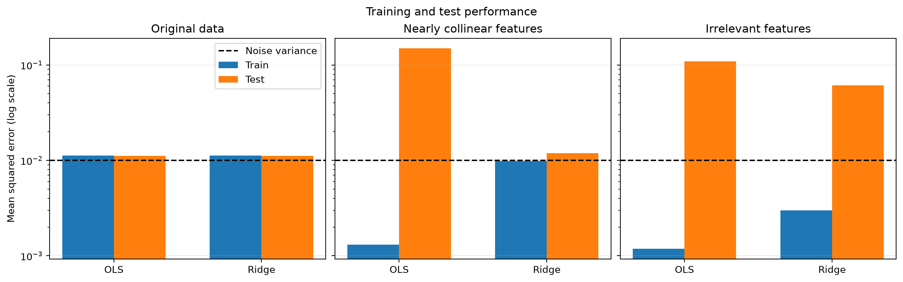
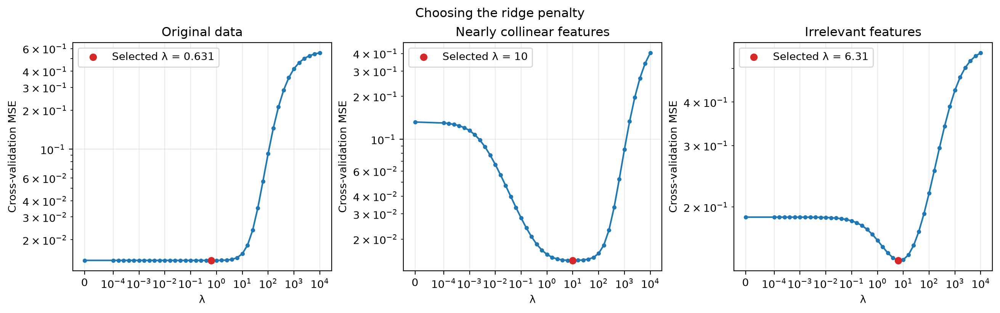

# OLS and ridge regression on synthetic data

## Assignment
(a) Generate a 300 ×20 data matrix X, where each entry is uniformly random. Generate
an outcome vector y, which is a linear combination of the columns of X with uniformly
random weights, and some Gaussian noise added to each entry of y.
(b) Write a function to divide the data set into a train and test sets.
(c) Write functions for OLS and ridge regression and apply them to your synthetic data set.
Discuss the performance on train and test sets.
(d) Create a data matrix with many multicolinearities by adding a large number (say, 200)
columns to X that are linear combinations of the original 20 columns with some Gaussian
noise added to each entry. Run OLS and ridge regression and discuss the performance on
train and test sets. Is it hard to find a good value for λ?
(e) Now instead of adding multicolinearities, add many irrelevant feature columns to X which
have no relation to the outcome vector y. Again run OLS and ridge regression and discuss
the performance on train and test sets.


## Experimental setup

This experiment compares ordinary least squares (OLS) and ridge regression on three data sets:

1. The original 300 observations with 20 useful features.
2. The original features plus 200 nearly collinear features.
3. The original features plus 200 independent, irrelevant features.

All experiments use the same outcome vector and the same train/test row split. The training set contains 240 observations and the test set contains 60. Results refer to one random realization, rather than an average over repeated experiments.

## (a) Generate the data

Each entry of the original matrix is sampled independently from a uniform distribution on [0, 1). The 20 true weights are also sampled independently from this distribution. The outcome is

$$
y = X\beta + \varepsilon, \qquad \varepsilon_i \sim \mathcal{N}(0, 0.1^2).
$$

The outcome noise variance is 0.01. A predictor that knows the true relationship has expected test MSE 0.01. This is a population benchmark; a finite test sample can produce a value above or below it.

The generated true weights are:

```text
0.45547638, 0.11885799, 0.56917343, 0.15642883, 0.06095833, 0.49866783, 0.65537345, 0.85414731, 0.78283555, 0.85724051, 0.76006877, 0.70323940, 0.01013757, 0.62610231, 0.12048180, 0.05866713, 0.15641215, 0.82329216, 0.74384939, 0.94877241
```

## (b) Split the data

The row indices are randomly permuted, with 20% assigned to the test set. Matching indices are used for X and y, keeping each observation paired with its outcome. The same split seed is used for all three experiments.

The test set is used only for final evaluation. Five-fold cross-validation selects the ridge penalty using the training set. Each cross-validation fit uses 192 training observations and 48 validation observations.

## (c) Fit OLS and ridge regression

For each fit, features are centered and divided by their training standard deviations. The outcome is centered using its training mean. Validation and test data use those same fitted statistics, preventing information leakage.

Let Z denote the standardized training matrix and let y_c denote the centered outcome. OLS minimizes

$$
\|y_c - Z\theta\|_2^2.
$$

Ridge minimizes

$$
\|y_c - Z\theta\|_2^2 + \lambda\|\theta\|_2^2.
$$

The intercept is handled by centering and is not penalized. Predictions are

$$
\hat y = \bar y + \left(\frac{X-\mu_X}{s_X}\right)\hat\theta,
$$

where division is applied feature by feature. The fitted coefficients are in standardized feature units. To express them in the original units, use beta_hat = theta_hat / s_X and intercept = y_mean - mu_X @ beta_hat.

The implementation uses NumPy least squares rather than explicitly forming a matrix inverse. Ridge is solved through an augmented least-squares system:

$$
\min_\theta\left\|
\begin{bmatrix} Z \\ \sqrt{\lambda}I \end{bmatrix}\theta
-
\begin{bmatrix} y_c \\ 0 \end{bmatrix}
\right\|_2^2.
$$

The penalty applies to standardized coefficients. Its numerical scale corresponds to a sum-of-squares loss; changing the loss to mean squared error changes the equivalent numerical lambda.

### Performance measure and results

The performance measure is mean squared error:

$$
\operatorname{MSE}(y,\hat y)=\frac{1}{n}\sum_{i=1}^{n}(y_i-\hat y_i)^2.
$$

| Data set | Features | OLS train MSE | OLS test MSE | Ridge train MSE | Ridge test MSE | Test MSE reduction with ridge |
|---|---:|---:|---:|---:|---:|---:|
| Original data | 20 | 0.011222 | 0.011163 | 0.011226 | 0.011124 | 0.35% |
| Nearly collinear features | 220 | 0.001306 | 0.149511 | 0.009864 | 0.011872 | 92.06% |
| Irrelevant features | 220 | 0.001179 | 0.109447 | 0.002980 | 0.061253 | 44.03% |

The percentage reduction is 100 times (OLS test MSE - ridge test MSE) / OLS test MSE. A negative value would indicate worse test performance with ridge.



*Figure 1. Training and test errors on a shared logarithmic vertical scale. The dashed line marks the outcome noise variance, 0.01. Source: calculations and plotting by regression_assignment.py using the synthetic data generated in this run.*

With the original features, OLS and ridge have similar train and test errors, close to the noise variance. There are substantially more training observations than features, and the model matches the relationship used to generate the data. Ridge offers only a small change in test performance for this realization.

OLS has training error no larger than ridge on the same data because it minimizes the unpenalized residual sum of squares. Ridge trades some training fit for more stable estimation.

## (d) Add nearly collinear features

The additional matrix is generated as

$$
X_{\mathrm{extra}} = XA + E,
$$

where A is a 20 by 200 matrix with independent uniform entries on [-1, 1), and each entry of E is Gaussian noise with standard deviation 0.05. The original and additional columns are concatenated, giving 220 features. The outcome y remains unchanged.

Because the added columns are approximately linear combinations of the original columns, the matrix has directions with small singular values. OLS amplifies outcome noise along those directions. Without the added feature noise, the added columns would be exactly redundant; the small noise instead creates extra directions that OLS can use to fit training residuals.

The observed OLS training error decreases strongly, while its test error increases. This gap indicates overfitting. Ridge accepts a larger training error but achieves a test error close to the original-data result. It limits coefficient growth in poorly determined directions.

## Choosing lambda

The candidate set contains zero and 41 logarithmically spaced positive values from 0.0001 to 10000. Zero corresponds to OLS. Each candidate is evaluated with five-fold cross-validation, and the candidate with the smallest mean validation MSE is selected. The model is then refitted on all 240 training observations.

| Data set | Selected lambda | Minimum mean cross-validation MSE |
|---|---:|---:|
| Original data | 0.630957 | 0.013857 |
| Nearly collinear features | 10 | 0.014166 |
| Irrelevant features | 6.30957 | 0.140517 |



*Figure 2. Mean cross-validation MSE versus lambda. The red point marks the selected candidate. A symmetric logarithmic horizontal axis allows lambda = 0 to be displayed. Vertical scales are logarithmic and differ between panels. Source: five-fold cross-validation and plotting by regression_assignment.py in this run.*

A broad minimum suggests that several penalty values give similar validation performance. A narrow minimum suggests greater sensitivity to the choice of lambda. As a descriptive check, the following table lists the smallest and largest tested candidates whose validation error lies within 5% of the observed minimum. These endpoints summarize qualifying grid points; they do not guarantee that every intermediate value qualifies, and they are not confidence intervals.

| Data set | Smallest qualifying lambda | Largest qualifying lambda | Number of qualifying grid points |
|---|---:|---:|---:|
| Original data | 0 | 6.30957 | 26 |
| Nearly collinear features | 2.51189 | 63.0957 | 8 |
| Irrelevant features | 3.98107 | 15.8489 | 4 |

Cross-validation makes it practical to find a useful penalty, but it does not establish a uniquely optimal population value. Validation errors depend on the random sample, fold assignment, and candidate grid. If the selected value lies at a positive grid boundary, expanding the grid can check whether the minimum lies outside the searched range.

With 220 features, each cross-validation fit has fewer observations (192) than features. The final fit has more observations (240) than features. These are different estimation regimes, so cross-validation errors can differ noticeably from final test errors. Sampling variability also contributes to the difference.

## (e) Add irrelevant features

For this experiment, 200 new columns are sampled independently from a uniform distribution on [0, 1), using a separate random seed. They are appended to the original X, rather than to the nearly collinear matrix. The outcome remains unchanged.

The added features have no population relationship with y. However, finite samples produce accidental correlations, and OLS uses these to fit training noise. Its low training error and much larger test error show overfitting.

Ridge reduces test error relative to OLS, but the result remains worse than using only the original features. Unlike the redundant columns in part (d), the irrelevant columns provide no additional representation of the signal. Ridge shrinks their coefficients, but also shrinks useful coefficients and does not explicitly discard features.

## Conclusions and limitations

On this realization, OLS performs well with the original 20 features. Adding 200 nearly collinear or irrelevant columns lowers its training error while worsening its test performance. Ridge improves generalization in both expanded data sets, with nearly collinear features recovering performance close to the original-data benchmark.

These conclusions describe one generated data set and one split. Repeated experiments across independent seeds would quantify how stable the comparisons are. The observed test set contains only 60 outcomes, so small differences between models should not be interpreted as decisive evidence.

## Reproducibility and output files

- Original-data seed: 42.
- Nearly collinear-feature seed: 43.
- Irrelevant-feature seed: 44.
- Train/test split seed: 42.
- Cross-validation fold seed: 45.
- Outcome noise standard deviation: 0.1.
- Nearly collinear-feature noise standard deviation: 0.05.
- Requirements: Python, NumPy, and Matplotlib.

Run:

```bash
python regression_assignment.py
```

The script saves results.md beside itself and saves both PNG figures in its img subfolder before displaying the figures. The Markdown image references are relative paths. Keep results.md and img together when moving or sharing the report.

The figures and numerical tables are generated from this experiment; no external images or experimental results are used.
